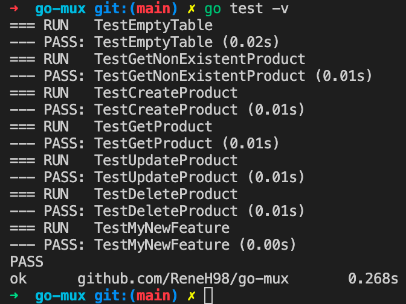
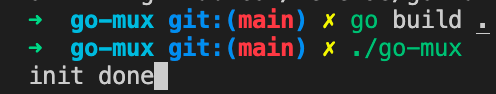
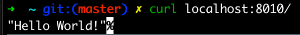
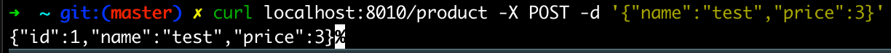
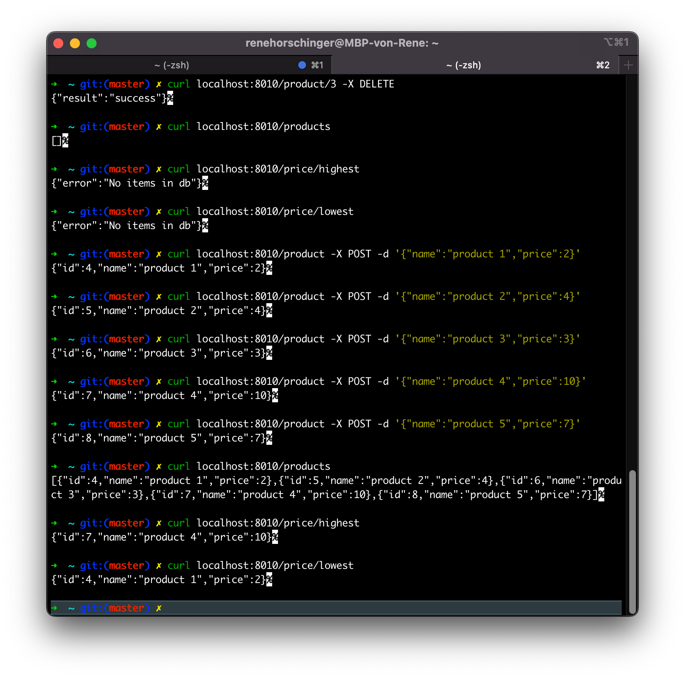
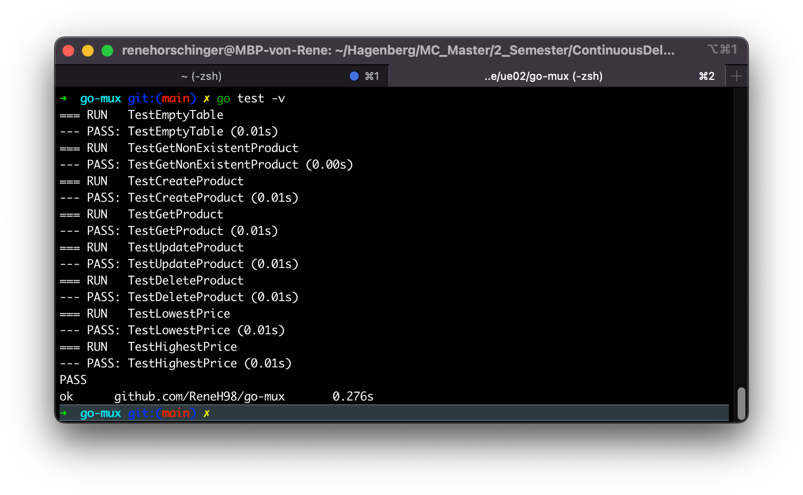

# Protocol Hörschinger Rene

## Step 1

just following the instructions and hardcode the username/password for the database in main_test.go

## Step 2

After starting postgres db in docker, all tests run smooth

In the app.Initialize I added the code:

    err = a.DB.Ping()
    if err != nil {
        panic(err)
    }

That way, the connection is tested on the startup, which then resulted in the error: "panic: pq: SSL is not enabled on the server"

In order to fix this, I needed the environment variables which only seem to work if they get sourced inside a .sh file

    $ source exports.sh

## Step 3 developing a new feature

In order to start the webserver, I adjusted the run function in app.go

    func (a *App) Run(addr string) { 
        log.Fatal(http.ListenAndServe(":8010", a.Router))
    }

Now I can build the project, run it and access the webserver over a browser:

As a feature, I want to support endpoints to get the highest and lowest priced items (or an error if there are no items in the db). Of course I could've done it with the SQL statement, but I wanted to play a little with GO, arrays, structs, etc.

Here I tested delete, products, post new products, highest and lowest endpoints:

I also added some tests for the highest and lowest endpoint:

